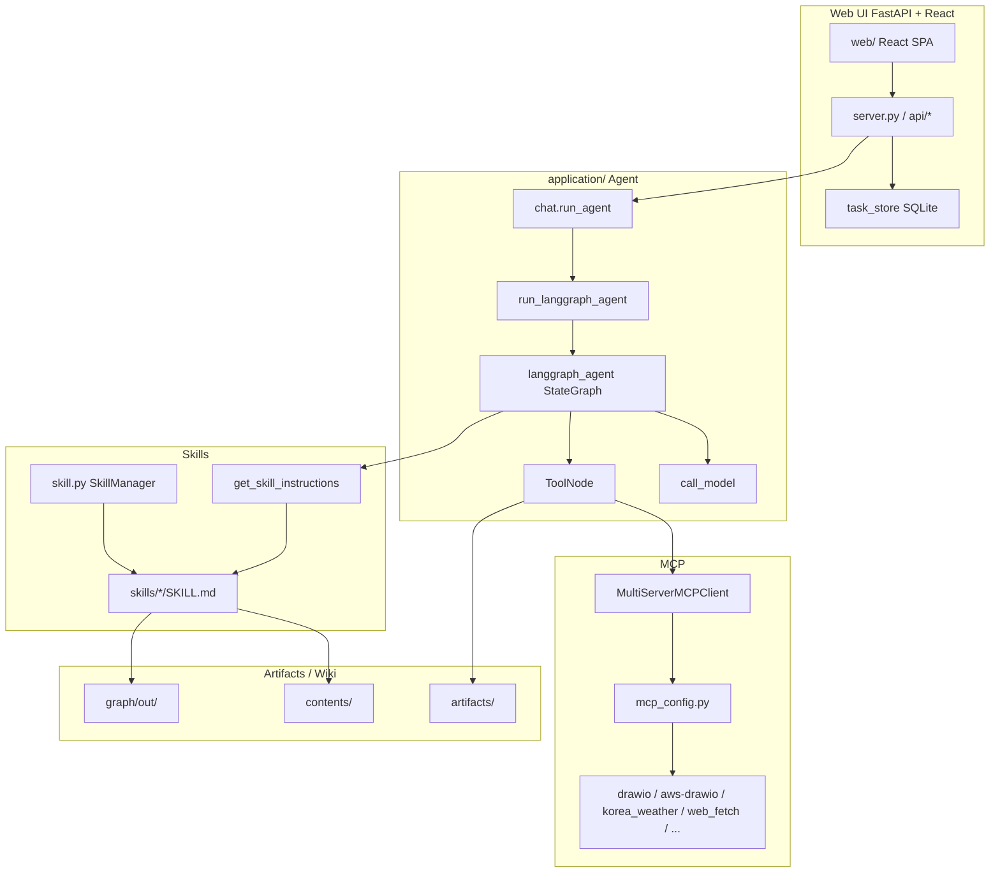

# Agent Wiki


OpenAI 공동 창업자이자 Tesla 전 AI 리드인 **Andrej Karpathy**는 구조화된 Markdown을 이용해 로컬에서 LLM Wiki를 활용하여 데이터를 조회하는 방법을 제안하였는데, RAG/벡터DB없이도 로컬에 있는 다양한 데이터를 Graph로 조회할 수 있는 방법을 제공합니다. 

### 핵심 루프 (Core Loop)

```
원시 데이터 투입 → LLM이 위키 컴파일·유지 → 쿼리 → 출력물 다시 위키에 저장 → 지식 복리 축적
```

| 항목 | 내용 |
|------|------|
| 저장 형식 | 구조화된 **Markdown 파일** (Obsidian) |
| 인프라 | RAG 파이프라인 없음, 벡터 DB 없음 |
| 자동 기능 | 인덱스, 요약, 토픽 간 백링크 자동 유지 |
| 린팅(Linting) | 불일치 감지, 새 아티클 필요 갭 자동 발굴 |
| 출력 형식 | Markdown 리포트, Marp 슬라이드, Matplotlib 차트 |
| 장기 비전 | 합성 데이터 생성 + 파인튜닝 → 모델 가중치에 코퍼스 내재화 |


## 개요

Web UI는 **FastAPI + React**이며, Agent는 **같은 프로세스**의 LangGraph로 실행합니다.

| 구분 | 경로 | 역할 |
|------|------|------|
| Web UI | `application/server.py`, `application/web/` | Task·Chat·Skill/MCP 설정, SSE 스트리밍 |
| Agent | `application/chat.py` → `langgraph_agent.py` | LangGraph ReAct + MCP + Skills |
| 설정 | `application/config.json`, `mcp.list`, `skills.list` | 모델·MCP·Skill 기본값 |

```text
Browser (React :8501)
    │  REST + SSE (/api/...)
    ▼
FastAPI (application/server.py)
    │  chat.run_agent(...)
    ▼
LangGraph (langgraph_agent) + MCP + Skills + Bedrock
```

## Operation Architecture



| 화면 | 설명 |
|------|------|
| Task Chat | 태스크별 세션 + SSE 스트리밍 (`chat.run_agent`) |
| Skill / MCP | 사이드바에서 Skill·MCP 선택 (기본: graphify, websearch, web_fetch) |
| 파일 업로드 | 이미지·문서 첨부 후 Agent에 전달 |


## ⚖️ LLM Wiki vs RAG — 언제 뭘 쓸까?

| **LLM Wiki가 유리한 경우** | **RAG가 유리한 경우** |
|---|---|
| 여러 문서를 넘나드는 복잡한 질문 | 실시간으로 변하는 대규모 데이터 |
| 깊은 이해와 합성이 필요할 때 | 단순 사실 조회 |
| 전문가가 직접 큐레이션한 코퍼스 | 출처(provenance) 추적이 중요할 때 |
| 구조적 추론이 필요한 질문 | 빠른 배포가 필요할 때 |

> 💡 **핵심 비유**: RAG는 데이터베이스 쿼리, LLM Wiki는 제2의 두뇌 — 경쟁 관계가 아니라 상호 보완 관계!

## graphify

코드, 문서, 논문, 이미지, 영상, YouTube 링크가 담긴 폴더를 /graphify 명령어 하나로 [쿼리 가능한 지식 그래프로 변환하는 Skill](https://github.com/safishamsi/graphify)입니다. graphify는 Karpathy의 /raw 폴더 아이디어를 실제로 구현한 도구이며, 어떤 폴더든 명령어 하나로 쿼리 가능한 지식 그래프로 만들어주는 강력한 오픈소스 프로젝트입니다.

```text
graphify-out/
├── graph.html       # 인터랙티브 그래프 (노드 클릭, 검색, 커뮤니티 필터)
├── GRAPH_REPORT.md  # God Node, 놀라운 연결, 추천 질문
├── graph.json       # 쿼리 가능한 영속 그래프
└── cache/           # SHA256 캐시 (변경된 파일만 재처리)
```

설치 방법은 아래와 같습니다.

```text
pip install graphifyy && graphify install
/graphify .   # 현재 폴더에 실행
```

전체 파이프라인은 아래와 같습니다.

```
detect() → extract() → build_graph() → cluster() → analyze() → report() → export()
```

앱 UI Knowledge Graph에서는 추출 HTML을 세 가지 시각화 패턴으로 볼 수 있습니다. 패턴·문서검색 상세는 아래 [Graph](#graph) 및 [graph/README.md](./graph/README.md)를 참고하세요.

### 지원 파일

- Code: .py, .ts, .js, .go, .rs, .java, .cpp, etc.
- Documents: .md, .txt, .docx, etc.
- Papers: .pdf
- Images: .png, .jpg, .webp (analyzed with vision)
- Video/Audio: .mp4, .mp3, .wav (transcribed with Whisper)

## Graph

`graph/`는 Agent 대화·코퍼스에서 뽑은 `graph.json`을 **vis-network** HTML로 publish합니다. 같은 그래프 데이터를 `patterns.py`가 세 가지 UI 패턴으로 렌더하며, 선택값은 사용자 `settings.json`의 `graph_pattern`에 저장됩니다. 패턴 전환 시 재추출 없이 HTML만 다시 생성합니다.

| 패턴 | 메뉴 이름 | 구현 | 레이아웃 / 비주얼 |
|------|-----------|------|-------------------|
| **pattern1** | Force Atlas | [pattern1_html.py](./graph/lib/pattern1_html.py) | `forceAtlas2Based`. degree에 비례한 큰 `dot` 노드, 커뮤니티 컬러 곡선 엣지(`curvedCCW`), 관계 라벨 표시. INFERRED는 점선. |
| **pattern2** | Neo4j Explore | [pattern2_html.py](./graph/lib/pattern2_html.py) | Neo4j Explore/Bloom 스타일. 어두운 캔버스, 작은 `dot` 노드, 얇은 회색 연속 곡선 엣지, 허브 위주 라벨. physics는 `barnesHut`. |
| **pattern3** | Holistic View | [pattern3_html.py](./graph/lib/pattern3_html.py) | Neo4j Browser식 전체 overview. 어두운 배경에서 로드 직후 `fit`. `ellipse` 라벨 노드 + 관계명(대문자) 엣지. `forceAtlas2Based`. |

공통 UI: 그룹(커뮤니티) 범례 필터, 엔티티 텍스트 검색, 노드 클릭 상세(출처·관계), 패턴 전환 버튼, **문서검색** 패널.

```text
graph.json (+ communities)
        │
        ▼
  patterns.write_pattern_html(pattern1|2|3)
        │
        ▼
  out/graph.html  ← Ask panel (ask_panel.py) 삽입
        │  POST /api/graph/query
        ▼
  application/graph_query.query_user_graph()
```


### 패턴별 특징과 장단점

세 패턴은 **같은 `graph.json`**을 쓰며, 차이점은 “무엇을 한눈에 보이게 하느냐”입니다.

#### Force Atlas (pattern1)

`forceAtlas2Based`로 커뮤니티가 벌어지고, degree가 큰 노드는 크게 보이며 엣지는 커뮤니티 컬러 + 관계 라벨(INFERRED는 점선)을 표시합니다.

| 장점 | 단점 |
|------|------|
| 허브·커뮤니티 구조가 직관적 | 노드·라벨이 많아 밀집 그래프에서 번잡 |
| 관계 종류·신뢰도를 캔버스에서 바로 확인 | Force Atlas 계산이 상대적으로 무거움 |
| 탐색·설명용으로 균형이 좋음 | “전체 지형”보다 “국소 구조” 중심 |

**적합:** 개념이 어떻게 묶이고 어떤 관계인지 설명할 때.

Force atlas로 보여주는 graph 화면입니다.


#### Neo4j Explore (pattern2)

Explore/Bloom 느낌의 **작은 점 + 얇은 회색 곡선**. 엣지 라벨·화살표는 거의 숨기고, physics는 빠른 `barnesHut`입니다.

| 장점 | 단점 |
|------|------|
| 대규모에서도 지형·클러스터가 잘 보임 | 관계명·방향은 hover/상세로만 확인 |
| 시각 노이즈가 적어 스크롤·줌이 편함 | 허브 크기 차이가 작아 중요도 파악이 약함 |
| 안정화·렌더가 비교적 가벼움 | “누가 누구를 참조하는지” 설명에는 약함 |

**적합:** 큰 그래프의 전체 모양·밀도·커뮤니티 분포를 훑을 때.

Neo4j explore로 보여주는 graph 화면입니다.


#### Holistic View (pattern3)

로드 직후 `fit`으로 전체를 담고, `ellipse` 라벨 노드 + 관계명(대문자)·화살표를 표시합니다. Force Atlas이지만 overlap 회피를 강하게 잡습니다.

| 장점 | 단점 |
|------|------|
| 전체 overview + 관계 라벨을 동시에 보여줌 | 엣지 라벨이 겹치면 가독성이 급격히 떨어짐 |
| Neo4j Browser식 “스키마 한눈에”에 가까움 | 노드 수·엣지 수가 많으면 글자가 포화 |
| 관계 중심 설명·데모에 유리 | Explore만큼 깔끔한 지형감은 약함 |

**적합:** 중간 규모에서 관계 종류까지 포함한 한 장 요약을 보여줄 때.

**한 줄 요약:** 구조·허브 → **Force Atlas**, 규모·지형 → **Neo4j Explore**, 관계 라벨까지 한눈에 → **Holistic View**.

Holistic view의 graph 화면입니다.


## 검색하는 방법

### 1️⃣ `/graphify query` - 질문으로 검색

가장 기본적인 검색 방법입니다. 자연어로 질문하면 그래프를 탐색해서 답변해줍니다.

```bash
# 기본 BFS 탐색 (넓게 탐색 - "X는 무엇과 연결되어 있나?")
/graphify query "RAG는 어떻게 동작하나요?"

# DFS 탐색 (깊게 탐색 - "X에서 Y까지 어떻게 연결되나?")
/graphify query "인증 모듈이 데이터베이스에 어떻게 연결되나?" --dfs

# 토큰 예산 제한 (기본값 2000)
/graphify query "트랜스포머 아키텍처란?" --budget 1500
```

| 모드 | 특징 | 적합한 질문 |
|------|------|------------|
| **BFS** (기본) | 넓게 탐색, 가까운 노드부터 | "X는 무엇인가?", "X와 연결된 것은?" |
| **DFS** (`--dfs`) | 깊게 탐색, 특정 경로 추적 | "X에서 Y까지 어떻게 연결되나?" |


### 2️⃣ `/graphify path` - 두 개념 사이의 최단 경로 찾기

두 노드 사이의 연결 경로를 찾아줍니다.

```bash
/graphify path "AuthModule" "Database"
/graphify path "RAG" "LLM"
```


### 3️⃣ `/graphify explain` - 특정 개념 설명

특정 노드(개념)에 대한 상세 설명과 연결 관계를 보여줍니다.

```bash
/graphify explain "SwinTransformer"
/graphify explain "RAG"
```

### 데이터 추가

```bash
/graphify /Documents/Docs --update
```

### PowerPoint 파일 추가하기

Graphify는 powerpoint 파일을 지원하지 않으므로 pdf로 변환하여 활용합니다. 이를 위해 아래와 같이 libreoffice를 설치합니다.

```bash
brew install --cask libreoffice
```

이후 대화창에 아래와 같이 폴더를 지정하고, pdf로 변환을 요청합니다.

```bash
/Downloads/Docs/AgenticAI의 ppt들을 pdf로 변환하세요. 이미 pdf가 있다면 skip 하세요.
```

### Message Trim

LangGraph 에이전트([application/langgraph_agent.py](./application/langgraph_agent.py)의 `call_model`)는 LLM 호출 직전에 **HumanMessage 기준 최근 N턴**만 남깁니다. LangGraph state의 `messages`는 checkpointer에 그대로 두고, **모델에 넘기는 메시지만** trim합니다. `history_mode=Enable`/`Disable` 모두 동일하게 적용됩니다.

**기본값:** `MAX_CONTEXT_TURNS = 5` (일반 채팅의 `SimpleMemory(k=5)`와 동일한 “최근 5턴” 의도)

**설정 변경:**

- [application/langgraph_agent.py](./application/langgraph_agent.py)의 `MAX_CONTEXT_TURNS` 상수 수정
- 또는 `create_agent()`에서 생성하는 config의 `max_turns` / `configurable.max_turns` 지정
- `max_turns=0`이면 trim 비활성화

상수와 trim 함수는 `langgraph_agent.py`에 정의합니다.

```python
# application/langgraph_agent.py
MAX_CONTEXT_TURNS = 5


def trim_messages_by_human_turns(messages: list, max_turns: int) -> list:
    """Keep messages from the last N HumanMessage turns (inclusive)."""
    if max_turns <= 0 or not messages:
        return messages

    human_indices = [i for i, msg in enumerate(messages) if isinstance(msg, HumanMessage)]
    if len(human_indices) <= max_turns:
        return messages

    return messages[human_indices[-max_turns]:]
```

`call_model`에서는 `ToolMessage` content 정규화 후 trim을 적용합니다.

```python
# application/langgraph_agent.py — call_model() 내부
        max_turns = (
            config.get("configurable", {}).get("max_turns")
            or config.get("max_turns")
            or MAX_CONTEXT_TURNS
        )
        trimmed = trim_messages_by_human_turns(messages, max_turns)
        if len(trimmed) < len(messages):
            logger.info(
                f"trimmed messages from {len(messages)} to {len(trimmed)} "
                f"(max_turns={max_turns})"
            )
            messages = trimmed

        prompt = ChatPromptTemplate.from_messages([
            ("system", system),
            MessagesPlaceholder(variable_name="messages"),
        ])
        chain = prompt | model
        async for chunk in chain.astream({"messages": messages}):
            ...
```

에이전트 config는 `create_agent()`에서 생성하며, `history_mode`와 관계없이 `max_turns`를 전달합니다.

```python
# application/langgraph_agent.py — create_agent()
    if history_mode == "Enable":
        app = buildChatAgentWithHistory(tools)
        config = {
            "recursion_limit": 100,
            "configurable": {"thread_id": user_id},
            "tools": tools,
            "system_prompt": system_prompt,
            "max_turns": MAX_CONTEXT_TURNS,
        }
    else:
        app = buildChatAgent(tools)
        config = {
            "recursion_limit": 100,
            "configurable": {"thread_id": user_id},
            "tools": tools,
            "system_prompt": system_prompt,
            "max_turns": MAX_CONTEXT_TURNS,
        }
```

**`max_turns=5`의 의미**

- **사용자 HumanMessage 5개**와, 각 턴에 이어진 **모든 후속 메시지**를 유지
- 1턴 = `HumanMessage` 1개 + 그 뒤의 `AIMessage`, `ToolMessage`, 도구 feedback loop 전체
- 도구를 여러 번 호출해도 **같은 사용자 질문이면 1턴**으로 카운트

**예 (도구 사용 포함)**

```
Human(Q1) → AI(tool_calls) → ToolMessage → AI(A1)
Human(Q2) → AI(A2)
Human(Q3) → AI(tool_calls) → ToolMessage → AI(A3)
```

`max_turns=2`이면 **Q2부터** 유지:

```
Human(Q2) → AI(A2) → Human(Q3) → AI(tool_calls) → ToolMessage → AI(A3)
```

**메시지 개수 trim과의 차이**

| 방식 | `N=5`일 때 |
|------|------------|
| 이전 (메시지 개수) | 메시지 객체 5개만 유지 → 도구 루프 때문에 사용자 턴 수가 불규칙 |
| 현재 (HumanMessage 턴) | 사용자 질문 5개 + 각 턴의 AI/Tool 응답 전체 유지 |

**Checkpointer와의 관계**

- `history_mode=Enable`일 때 `MemorySaver` checkpointer에는 **전체 대화 이력**이 저장됩니다.
- trim은 LLM 컨텍스트 윈도우 관리용이며, 저장된 history를 삭제하지 않습니다.
- 애플리케이션 로그에서 `trimmed messages from X to Y (max_turns=5)`로 trim 여부를 확인할 수 있습니다.


## 문서검색

그래프 HTML의 **문서검색**은 엔티티 이름 필터와 별개로, 질문 → 관련 노드 탐색 → **소스 파일 본문 excerpt**까지 보여주는 흐름입니다.

1. **UI** — 세 패턴 HTML에 [ask_panel.py](./graph/lib/ask_panel.py)의 CSS/HTML/JS가 주입됩니다. `문서검색` 버튼 → 패널에서 질문 입력 → `POST /api/graph/query` (`credentials: same-origin`).
2. **API** — [routes_graph.py](./application/api/routes_graph.py)가 세션 사용자 `graph.json` 경로를 정한 뒤 [graph_query.py](./application/graph_query.py)의 `query_user_graph()`를 호출합니다.
3. **시작 노드 매칭**
   - 질문을 토큰화(영문 ≥3자, CJK ≥2자).
   - 노드 **label** 부분 일치로 상위 후보 선정.
   - label이 비어도(또는 보강용으로) 노드의 `source_file` **본문**에 질의어가 있으면 점수를 올려 시작 노드로 사용 — 라벨은 영어인데 질의가 한국어인 경우 등.
4. **그래프 순회** — 기본 **BFS**(깊이 3), 옵션 **DFS**(깊이 6). 관련 노드·엣지를 모은 뒤 relevance로 정렬하고 token `budget`으로 truncate.
5. **소스 excerpt** — 매칭 노드의 `source_file`을 허용 루트 안에서만 읽고, 질의어·라벨·`source_location`이 겹치는 문단을 뽑아 패널에 표시합니다.
6. **그래프 하이라이트** — 응답 노드 opacity를 올리고, 칩 클릭 시 해당 노드로 `focus`합니다.

CLI의 `/graphify query`와 같은 BFS/DFS·budget 개념을 앱 내 문서검색이 재사용합니다. 파이프라인·LLM 설정은 [graph/README.md](./graph/README.md)를 참고하세요.

문서 검색을 하면 아래와 같이 시작 노드로 부터 관련 노드를 찾습니다.


결과적으로 Corpus로 부터 아래와 같이 관련문서를 가져올 수 있습니다.


## 실행 방법

소스를 다운로드 합니다.

```bash
git clone https://github.com/kyopark2014/agent-wiki
```

필요한 패키지를 설치한 뒤, 프론트를 빌드하고 FastAPI를 실행합니다.

```bash
cd agent-wiki && pip install -r requirements.txt

# 프론트 빌드 후 FastAPI (포트 8501)
./run_local.sh

# 또는
cd application/web && npm install && npm run build && cd ../..
uvicorn application.server:app --host 0.0.0.0 --port 8501
```

브라우저: [http://localhost:8501](http://localhost:8501)

- 최초 접속 시 User ID를 입력하면 쿠키로 세션이 유지됩니다.
- Agent는 AgentCore Runtime이 아니라 **로컬 LangGraph**로 동작합니다.

프론트만 수정할 때:

```bash
cd application/web && npm run dev   # Vite :5173, /api → :8501 프록시
# 다른 터미널
uvicorn application.server:app --host 0.0.0.0 --port 8501
```


## 실행 결과


아래와 같이 "/graphify contents/"를 하면 contents 폴더의 파일들을 가지고 graph를 생성합니다.


이후 아래와 같이 "/graphify query RAG를 LLM Wiki로 전환하는 방법은?"라고 질문하면 아래와 같이 그래프를 조회합니다.


최종적으로 아래와 같은 결과를 얻을 수 있습니다.


생성된 graph는 아래와 같습니다.


## Reference

[RAG Is Not Enough. Karpathy Just Showed Us What Comes Next.](./contents/rag_vs_llm_wiki_summary.md)

[What Karpathy’s Second Brain Looks Like Inside a Real Business](./contents/karpathy_second_brain_in_business_summary.md)

[Andrej Karpathy let an agent run overnight on his own model.](./contents/karpathy_autoresearch_overnight_summary.md)

[Karpathy on AI Coding Agents](./contents/karpathy_ai_coding_agents_summary.md)

[Andrej Karpathy Just Redefined the "Second Brain", and It Has Massive Implications for Enterprise Innovation.](./contents/karpathy_second_brain_enterprise_summary.md)

[Karpathy's viral LLM Knowledge Base blueprint](./contents/karpathy_viral_llm_knowledge_base_blueprint_summary.md)

[safishamsi / graphify](https://github.com/safishamsi/graphify)
