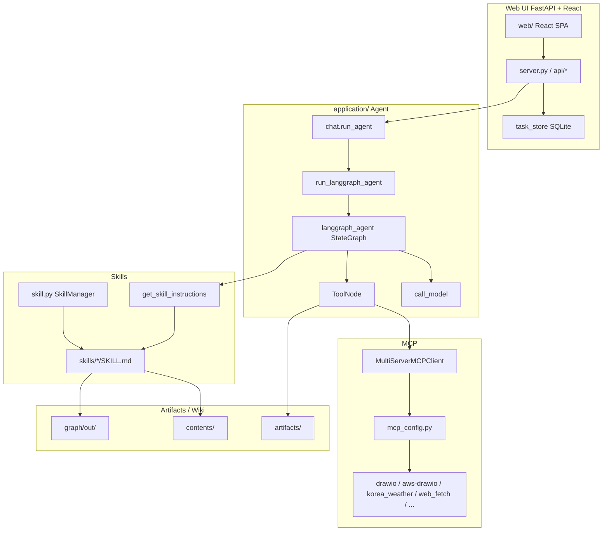
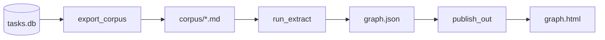

# Agent Wiki

[English](./README_en.md)

OpenAI 공동 창업자이자 Tesla 전 AI 리드인 **Andrej Karpathy**는 구조화된 Markdown을 이용해 로컬에서 LLM Wiki를 활용하여 데이터를 조회하는 방법을 제안하였습니다. RAG/벡터 DB 없이도 로컬 코퍼스를 **지식 그래프**로 조회·합성할 수 있는 흐름입니다.

**agent-wiki**는 그 아이디어를 **웹 Agent + 자동 Knowledge Graph**로 구현한 프로젝트입니다.

| 이 프로젝트가 하는 일 | 설명 |
|----------------------|------|
| 대화형 Agent | FastAPI + React UI에서 LangGraph ReAct Agent로 채팅 (Skills · MCP · Bedrock/LiteLLM) |
| 지식 축적 | 대화·업로드·contents 문서를 turn corpus로 남기고, LLM으로 엔티티·관계를 추출 |
| Knowledge Graph | 사용자별 `graph.json` / `graph.html` — Force Atlas · Neo4j Explore · Holistic View |
| 문서검색 | 그래프 순회(BFS/DFS) + 소스 본문 excerpt (벡터 DB 없음) |

벡터 검색(RAG)과 병행할 수도 있지만, 기본 지식 탐색 경로는 **마크다운 위키 · 그래프 순회**입니다.

### 핵심 루프 (Core Loop)

```
원시 데이터 투입 → LLM이 위키·그래프 컴파일·유지 → 쿼리 → 출력물 다시 위키에 저장 → 지식 복리 축적
```

| 항목 | 내용 |
|------|------|
| 저장 형식 | 구조화된 **Markdown 파일** (Obsidian 호환 가능) |
| 인프라 | RAG 파이프라인 필수 아님, 벡터 DB 필수 아님 |
| 자동 기능 | 인덱스, 요약, 토픽 간 백링크·커뮤니티 유지 |
| 린팅(Linting) | 불일치 감지, 새 아티클 필요 갭 자동 발굴 |
| 출력 형식 | Markdown 리포트, Marp 슬라이드, Matplotlib 차트, 인터랙티브 graph HTML |
| 장기 비전 | 합성 데이터 생성 + 파인튜닝 → 모델 가중치에 코퍼스 내재화 |

---

## 목차

1. [개요](#개요)
2. [Operation Architecture](#operation-architecture)
3. [LLM Wiki vs RAG](#️-llm-wiki-vs-rag--언제-뭘-쓸까)
4. [graphify](#graphify) — corpus → graph 파이프라인
5. [Graph](#graph) — 시각화 패턴 · 장단점
6. [검색하는 방법](#검색하는-방법) — `/graphify` CLI
7. [문서검색](#문서검색) — 앱 내 Ask 패널
8. [실행 방법](#실행-방법)
9. [실행 결과](#실행-결과)
10. [Reference](#reference)

---

## 개요

Web UI는 **FastAPI + React**이며, Agent는 **같은 프로세스**의 LangGraph로 실행합니다. 별도 AgentCore Runtime 없이도 로컬에서 동작합니다.

| 구분 | 경로 | 역할 |
|------|------|------|
| Web UI | `application/server.py`, `application/web/` | Task·Chat·Skill/MCP 설정, SSE 스트리밍 |
| Agent | `application/chat.py` → `langgraph_agent.py` | LangGraph ReAct + MCP + Skills |
| Graph 파이프라인 | `graph/` | tasks.db → corpus → LLM 추출 → `graph.html` |
| Graph API | `application/api/routes_graph.py`, `graph_query.py` | HTML 제공 · 문서검색 · rebuild |
| 설정 | `application/config.json`, `mcp.list`, `skills.list` | 모델·MCP·Skill·LiteLLM gateway 기본값 |

```text
Browser (React :8501)
    │  REST + SSE (/api/...)
    ▼
FastAPI (application/server.py)
    │  chat.run_agent(...)
    ▼
LangGraph (langgraph_agent) + MCP + Skills + Bedrock / LiteLLM
```

### 주요 사용 흐름

1. **채팅** — Task를 만들고 Skill/MCP를 고른 뒤 질문. 응답은 SSE로 스트리밍되며 `tasks.db`에 저장됩니다.
2. **Knowledge Graph 열기** — 사이드바 브랜드 **Agent wiki (user)** 클릭 → 모달 iframe으로 `GET /api/graph` HTML 표시.
3. **패턴 전환** — 그래프 UI에서 Force Atlas / Neo4j Explore / Holistic View 선택 → `settings.json`의 `graph_pattern` 저장 후 HTML만 재생성.
4. **문서검색** — 그래프의 **문서검색** 패널에서 자연어 질문 → 관련 노드 + corpus 본문 excerpt.
5. **수동/증분 추출** — 대화가 쌓이면 백그라운드 job 또는 `graph/run_pipeline.py`로 corpus·그래프를 갱신.

### 디렉터리 구조 (요약)

```text
agent-wiki/
├── application/          # FastAPI · LangGraph · React web · Skills
│   ├── server.py
│   ├── chat.py / langgraph_agent.py
│   ├── graph_query.py / graph_jobs.py
│   ├── api/routes_graph.py
│   └── web/              # React SPA
├── graph/                # 단독 Knowledge Graph 파이프라인
│   ├── run_pipeline.py
│   ├── export_corpus.py / run_extract.py / publish_out.py
│   └── lib/              # semantic, patterns, ask_panel, …
├── contents/             # 위키·참고 Markdown 코퍼스
├── README.md / README_en.md
└── requirements.txt
```

사용자별 세션 데이터(대화 DB, graph corpus/out, settings)는 보통 session storage 아래 `{user}/`에 두며, 그래프는 `{user}/graph/out/graph.html` 형태로 publish됩니다. 상세 경로는 [graph/README.md](./graph/README.md)를 참고하세요.

## Operation Architecture



| 화면 / 기능 | 설명 |
|-------------|------|
| Task Chat | 태스크별 세션 + SSE 스트리밍 (`chat.run_agent`). 핀·이름 변경·삭제 지원 |
| Skill / MCP | 사이드바에서 Skill·MCP 선택 (기본 예: graphify, websearch, web_fetch) |
| 파일 업로드 | 이미지·문서 첨부 후 Agent에 전달 |
| Knowledge Graph | 브랜드 클릭 → `KnowledgeGraphModal` → `/api/graph` |
| Settings | Knowledge Graph on/off, `graph_pattern` 등 사용자 설정 |

Agent는 도구(MCP)·Skill 지시문을 받아 ReAct 루프로 동작합니다.

---

## ⚖️ LLM Wiki vs RAG — 언제 뭘 쓸까?

| **LLM Wiki가 유리한 경우** | **RAG가 유리한 경우** |
|---|---|
| 여러 문서를 넘나드는 복잡한 질문 | 실시간으로 변하는 대규모 데이터 |
| 깊은 이해와 합성이 필요할 때 | 단순 사실 조회 |
| 전문가가 직접 큐레이션한 코퍼스 | 출처(provenance) 추적이 중요할 때 |
| 구조적 추론이 필요한 질문 | 빠른 배포가 필요할 때 |

> 💡 **핵심 비유**: RAG는 데이터베이스 쿼리, LLM Wiki는 제2의 두뇌 — 경쟁 관계가 아니라 상호 보완 관계!

agent-wiki에서는 **채팅 Agent(필요 시 RAG MCP)** 와 **그래프 문서검색**을 함께 둘 수 있습니다. 그래프 쪽은 임베딩 인덱스 없이 `graph.json` 순회 + 원문 excerpt로 답을 보강합니다.

## graphify

코드, 문서, 논문, 이미지, 영상, YouTube 링크가 담긴 폴더를 `/graphify` 명령어 하나로 [쿼리 가능한 지식 그래프로 변환하는 Skill](https://github.com/safishamsi/graphify)입니다. Karpathy의 `/raw` 폴더 아이디어를 실제로 구현한 오픈소스이며, **폴더 단위 일괄 추출**에 강합니다.

업스트림 CLI가 남기는 산출물 예:

```text
graphify-out/
├── graph.html       # 인터랙티브 그래프 (노드 클릭, 검색, 커뮤니티 필터)
├── GRAPH_REPORT.md  # God Node, 놀라운 연결, 추천 질문
├── graph.json       # 쿼리 가능한 영속 그래프
└── cache/           # SHA256 캐시 (변경된 파일만 재처리)
```

설치 (업스트림 CLI / Skill용):

```text
pip install graphifyy && graphify install
/graphify .   # 현재 폴더에 실행
```

업스트림 graphify CLI 파이프라인:

```
detect() → extract() → build_graph() → cluster() → analyze() → report() → export()
```

### agent-wiki에서의 역할

이 저장소에서는 Cursor `/graphify` Skill에만 의존하지 않습니다. [`graph/`](./graph/) 단독 파이프라인이 Agent 대화 DB를 읽어 **tasks.db → corpus → graph.json → HTML**을 만듭니다. 오케스트레이터는 [run_pipeline.py](./graph/run_pipeline.py)입니다.

- **채팅에서의 `/graphify …`**: Skill이 contents 등 폴더를 그래프로 만들거나 질의할 때 (실행 결과 스크린샷 참고).
- **앱 Knowledge Graph**: 사용자 대화 turn을 자동/수동으로 추출해 사이드바에서 보는 HTML 그래프 + 문서검색.



### corpus → graph 추출 단계

| 단계 | 스크립트 / 모듈 | LLM? | 하는 일 |
|------|-----------------|------|---------|
| 1. Turn 추출 | [tasks_db.py](./graph/lib/tasks_db.py) `build_turns` | 없음 | SQLite에서 user↔assistant **turn** 쌍을 만듦 |
| 2. Corpus 내보내기 | [export_corpus.py](./graph/export_corpus.py) + [corpus.py](./graph/lib/corpus.py) | 없음 | turn을 YAML frontmatter + 본문 `.md`로 저장. `--user` 기본은 **delta**(변경분만) + SHA256 캐시 miss를 [extract_queue](./graph/lib/extract_queue.py)에 적재 |
| 3. 시맨틱 추출 | [run_extract.py](./graph/run_extract.py) → [semantic.py](./graph/lib/semantic.py) | **있음** | corpus chunk(기본 8파일)를 LLM에 넘겨 nodes/edges/hyperedges JSON 추출. LLM은 [llm.py](./graph/lib/llm.py)가 LiteLLM gateway 또는 Bedrock Converse로 호출 |
| 4. 그래프 빌드 | [build_graph.py](./graph/lib/build_graph.py) `build_and_export` | 없음 | graphifyy `build_from_json` → Leiden/Louvain **cluster** → God Node·놀라운 연결 분석 → `graph.json` + `GRAPH_REPORT.md` |
| 5. HTML publish | [publish_out.py](./graph/publish_out.py) → [out_graphs.py](./graph/lib/out_graphs.py) / [patterns.py](./graph/lib/patterns.py) | 없음 | `graph.json`을 Force Atlas / Neo4j Explore / Holistic View HTML로 렌더 |

**관계가 만들어지는 지점:** Leiden/Louvain은 **커뮤니티만** 나눕니다. 엣지와 confidence는 3단계 LLM이 JSON으로 명시한 결과입니다.

| relation (예) | 의미 |
|---------------|------|
| `references` / `calls` / `implements` / `cites` | 명시적 참조·호출·구현·인용 |
| `conceptually_related_to` / `shares_data_with` | 개념·데이터 관련 |
| `semantically_similar_to` | 구조 링크 없이 같은 문제 (보통 INFERRED) |
| `rationale_for` | 설계 이유 → 대상 개념 |

| confidence | 의미 |
|------------|------|
| EXTRACTED | 원문에 드러남 (score 1.0) |
| INFERRED | 추론 (보통 0.6–0.9) · HTML에서 점선으로 표시되는 경우 있음 |
| AMBIGUOUS | 불확실 (0.1–0.3) |

### LLM 설정 (추출용)

1. **우선**: `application/config.json`의 `llm_gateway_url` / `llm_gateway_key`
2. **fallback**: 환경변수 `LLM_GATEWAY_URL` / `LLM_GATEWAY_KEY`
3. **gateway 없음**: AWS Bedrock Converse (boto3 자격증명). 모델은 `GRAPHIFY_LLM_MODEL` 등 — 상세는 [graph/README.md](./graph/README.md)

```bash
cd agent-wiki/graph
python -m pip install -r requirements.txt
python run_pipeline.py --user user01          # 증분: delta export + queue extract
python run_pipeline.py --user user01 --full   # corpus 재구축 + 미캐시 재추출
# 단계별
python export_corpus.py --user user01
python run_extract.py --from-queue           # 또는 전체: run_extract.py
python publish_out.py --user user01
```

앱에서도 Settings로 Knowledge Graph를 켠 뒤 `POST /api/graph/rebuild`로 백그라운드 추출을 걸 수 있습니다 (`graph_jobs.py`, 쿨다운·지문 스킵 포함).

앱 UI Knowledge Graph의 시각화·문서검색은 아래 [Graph](#graph)를 참고하세요.

### 지원 파일 (업스트림 /graphify Skill 기준)

- Code: .py, .ts, .js, .go, .rs, .java, .cpp, etc.
- Documents: .md, .txt, .docx, etc.
- Papers: .pdf
- Images: .png, .jpg, .webp (vision 분석)
- Video/Audio: .mp4, .mp3, .wav (Whisper 전사)

agent-wiki `graph/` 파이프라인의 기본 입력은 **대화 turn 마크다운**입니다. 폴더 단위 멀티모달 추출은 Skill/CLI `/graphify` 경로를 사용합니다.

## Graph

`graph/`는 Agent 대화·코퍼스에서 뽑은 `graph.json`을 **vis-network** HTML로 publish합니다. 같은 그래프 데이터를 `patterns.py`가 세 가지 UI 패턴으로 렌더하며, 선택값은 사용자 `settings.json`의 `graph_pattern`에 저장됩니다. 패턴 전환 시 **재추출 없이 HTML만** 다시 생성합니다.

### UI에서 보기

```text
Sidebar "Agent wiki (user)" 클릭
  → KnowledgeGraphModal + iframe
  → GET /api/graph  (세션 쿠키의 graph.html)
```

| API | 역할 |
|-----|------|
| `GET /api/graph` | 사용자 그래프 HTML 인라인 표시 |
| `GET /api/graph/status` | 존재 여부 · job 상태 · enabled |
| `POST /api/graph/rebuild` | 백그라운드 파이프라인 enqueue |
| `POST /api/graph/query` | 문서검색 (BFS/DFS + excerpt) |

그래프가 아직 없으면 안내 HTML이 뜨고, 추출이 끝나면 모달을 다시 열면 됩니다. 구버전 HTML에 문서검색 UI가 없으면 서버가 `graph.json`으로부터 republish를 시도합니다.

| 패턴 | 메뉴 이름 | 구현 | 레이아웃 / 비주얼 |
|------|-----------|------|-------------------|
| **pattern1** | Force Atlas | [pattern1_html.py](./graph/lib/pattern1_html.py) | `forceAtlas2Based`. degree에 비례한 큰 `dot` 노드, 커뮤니티 컬러 곡선 엣지(`curvedCCW`), 관계 라벨. INFERRED는 점선. |
| **pattern2** | Neo4j Explore | [pattern2_html.py](./graph/lib/pattern2_html.py) | Neo4j Explore/Bloom 스타일. 어두운 캔버스, 작은 `dot` 노드, 얇은 회색 연속 곡선 엣지, 허브 위주 라벨. physics는 `barnesHut`. |
| **pattern3** | Holistic View | [pattern3_html.py](./graph/lib/pattern3_html.py) | Neo4j Browser식 전체 overview. 로드 직후 `fit`. `ellipse` 라벨 노드 + 관계명(대문자) 엣지. `forceAtlas2Based`. |

공통 UI: 그룹(커뮤니티) 범례 필터, 좌상단 **문서검색**(Enter로 쿼리, 검색창·결과가 하나의 카드), 노드 클릭 상세(출처·관계), 패턴 전환 버튼.

```text
graph.json (+ communities)
        │
        ▼
  patterns.write_pattern_html(pattern1|2|3)
        │
        ▼
  out/graph.html  ← Ask panel (ask_panel.py) 삽입
        │  POST /api/graph/query
        ▼
  application/graph_query.query_user_graph()
```

### 패턴별 특징과 장단점

세 패턴은 **같은 `graph.json`**을 쓰며, 차이점은 “무엇을 한눈에 보이게 하느냐”입니다.

#### Force Atlas (pattern1)

`forceAtlas2Based`로 커뮤니티가 벌어지고, degree가 큰 노드는 크게 보이며 엣지는 커뮤니티 컬러 + 관계 라벨(INFERRED는 점선)을 표시합니다.

| 장점 | 단점 |
|------|------|
| 허브·커뮤니티 구조가 직관적 | 노드·라벨이 많아 밀집 그래프에서 번잡 |
| 관계 종류·신뢰도를 캔버스에서 바로 확인 | Force Atlas 계산이 상대적으로 무거움 |
| 탐색·설명용으로 균형이 좋음 | “전체 지형”보다 “국소 구조” 중심 |

**적합:** 개념이 어떻게 묶이고 어떤 관계인지 설명할 때.

Force atlas로 보여주는 graph 화면입니다.


#### Neo4j Explore (pattern2)

Explore/Bloom 느낌의 **작은 점 + 얇은 회색 곡선**. 엣지 라벨·화살표는 거의 숨기고, physics는 빠른 `barnesHut`입니다.

| 장점 | 단점 |
|------|------|
| 대규모에서도 지형·클러스터가 잘 보임 | 관계명·방향은 hover/상세로만 확인 |
| 시각 노이즈가 적어 스크롤·줌이 편함 | 허브 크기 차이가 작아 중요도 파악이 약함 |
| 안정화·렌더가 비교적 가벼움 | “누가 누구를 참조하는지” 설명에는 약함 |

**적합:** 큰 그래프의 전체 모양·밀도·커뮤니티 분포를 훑을 때.

Neo4j explore로 보여주는 graph 화면입니다.


#### Holistic View (pattern3)

로드 직후 `fit`으로 전체를 담고, `ellipse` 라벨 노드 + 관계명(대문자)·화살표를 표시합니다. Force Atlas이지만 overlap 회피를 강하게 잡습니다.

| 장점 | 단점 |
|------|------|
| 전체 overview + 관계 라벨을 동시에 보여줌 | 엣지 라벨이 겹치면 가독성이 급격히 떨어짐 |
| Neo4j Browser식 “스키마 한눈에”에 가까움 | 노드 수·엣지 수가 많으면 글자가 포화 |
| 관계 중심 설명·데모에 유리 | Explore만큼 깔끔한 지형감은 약함 |

**적합:** 중간 규모에서 관계 종류까지 포함한 한 장 요약을 보여줄 때.

**한 줄 요약:** 구조·허브 → **Force Atlas**, 규모·지형 → **Neo4j Explore**, 관계 라벨까지 한눈에 → **Holistic View**.

Holistic view의 graph 화면입니다.


---

## 검색하는 방법

채팅에서 graphify **Skill**이 활성화된 경우, 에이전트에게 `/graphify …` 형태의 요청으로 그래프를 질의할 수 있습니다. (폴더 추출·CLI와 동일한 개념의 query / path / explain)

앱 Knowledge Graph HTML의 **문서검색**과는 UI가 다릅니다. 앱 내 검색은 [문서검색](#문서검색)을 보세요.

### 1️⃣ `/graphify query` - 질문으로 검색

가장 기본적인 검색 방법입니다. 자연어로 질문하면 그래프를 탐색해서 답변해줍니다.

```bash
# 기본 BFS 탐색 (넓게 탐색 - "X는 무엇과 연결되어 있나?")
/graphify query "RAG는 어떻게 동작하나요?"

# DFS 탐색 (깊게 탐색 - "X에서 Y까지 어떻게 연결되나?")
/graphify query "인증 모듈이 데이터베이스에 어떻게 연결되나?" --dfs

# 토큰 예산 제한 (기본값 2000)
/graphify query "트랜스포머 아키텍처란?" --budget 1500
```

| 모드 | 특징 | 적합한 질문 |
|------|------|------------|
| **BFS** (기본) | 넓게 탐색, 가까운 노드부터 | "X는 무엇인가?", "X와 연결된 것은?" |
| **DFS** (`--dfs`) | 깊게 탐색, 특정 경로 추적 | "X에서 Y까지 어떻게 연결되나?" |


### 2️⃣ `/graphify path` - 두 개념 사이의 최단 경로 찾기

두 노드 사이의 연결 경로를 찾아줍니다.

```bash
/graphify path "AuthModule" "Database"
/graphify path "RAG" "LLM"
```


### 3️⃣ `/graphify explain` - 특정 개념 설명

특정 노드(개념)에 대한 상세 설명과 연결 관계를 보여줍니다.

```bash
/graphify explain "SwinTransformer"
/graphify explain "RAG"
```

### 데이터 추가

```bash
/graphify /Documents/Docs --update
```

### PowerPoint 파일 추가하기

Graphify는 PowerPoint를 직접 지원하지 않으므로 PDF로 변환해 넣습니다. LibreOffice 예:

```bash
brew install --cask libreoffice
```

대화창에서 폴더를 지정해 변환을 요청할 수 있습니다.

```bash
/Downloads/Docs/AgenticAI의 ppt들을 pdf로 변환하세요. 이미 pdf가 있다면 skip 하세요.
```

---

## 문서검색

그래프 HTML의 **문서검색**은 좌상단 `Search entities...` 입력에서 Enter로 실행됩니다. 질문 → 관련 노드 탐색 → **소스 파일 본문 excerpt**까지 같은 카드에 보여 줍니다. 기본은 `graph.json` + 원문 파일이며, 시작 노드 선정에 **임베딩 hybrid**를 씁니다(벡터 DB 불필요 — `out/node_embeddings.json` 사이드카).

1. **UI** — 세 패턴 HTML에 [ask_panel.py](./graph/lib/ask_panel.py)의 CSS/HTML/JS가 주입됩니다. 좌상단 검색 Enter → `POST /api/graph/query` (`credentials: same-origin`). 검색 시 범례는 자동으로 숨겨집니다.
2. **API** — [routes_graph.py](./application/api/routes_graph.py)가 세션 사용자 `graph.json` 경로를 정한 뒤 [graph_query.py](./application/graph_query.py)의 `query_user_graph()`를 호출합니다.
3. **시작 노드 매칭** (lexical ∪ embedding)
   - 질문을 토큰화(영문 ≥3자, CJK ≥2자).
   - 노드 **label** 부분 일치로 상위 후보 선정.
   - label이 비어도(또는 보강용으로) 노드의 `source_file` **본문**에 질의어가 있으면 점수를 올려 시작 노드로 사용 — 라벨은 영어인데 질의가 한국어인 경우 등.
   - **임베딩**: LiteLLM `titan-embed-v2`(Bedrock Titan Text Embeddings V2)로 질문·노드 label 벡터를 비교(코사인 ≥ 0.35). `날씨` ↔ `Weather` 같은 유사어를 label 부분일치 없이도 시작 노드로 잡습니다. publish/`republish` 시 `out/node_embeddings.json`을 만들고, 없거나 stale이면 query 때 lazy rebuild. 게이트웨이 미설정·실패 시 lexical만 사용.
4. **그래프 순회** — 기본 **BFS**(깊이 3), 옵션 **DFS**(깊이 6). 관련 노드·엣지를 모은 뒤 relevance로 정렬하고 token `budget`으로 truncate.
5. **소스 excerpt** — 매칭 노드의 `source_file`을 허용 루트 안에서만 읽고, 질의어·라벨·`source_location`이 겹치는 문단을 패널에 표시합니다.
6. **그래프 하이라이트** — 응답 노드 opacity를 올리고, 칩 클릭 시 해당 노드로 `focus`합니다.

**임베딩 설정:** `application/config.json`의 **`hybrid_graph_search`**가 `"enable"`일 때만 문서검색에 Titan 임베딩 hybrid(vector search)를 켭니다. 그 외 값(또는 미설정)이면 lexical만 사용합니다. 현재 기본값은 `"enable"`입니다.

게이트웨이: `llm_gateway_url` / `llm_gateway_key`가 있으면 LiteLLM `titan-embed-v2`, 없으면 Bedrock `amazon.titan-embed-text-v2:0` 직접 호출. env `GRAPHIFY_EMBEDDING_MODEL`(기본 `titan-embed-v2`), `GRAPHIFY_EMBEDDING_DIM`(기본 1024).

### Hybrid 동작 (예: 질문 `"날씨"`)

유사어 목록을 만든 뒤 그 단어들로 **다시 lexical 검색**하는 구조가 **아닙니다**. lexical과 embedding은 둘 다 **시작 노드를 고르는** 단계이고, 그다음 본체는 **그래프 순회**입니다.

```text
질문 "날씨"
  ├─ 1. Lexical ──► label/본문에 "날씨" 부분일치 → 시작 노드 (최대 3)
  ├─ 2. Embedding ► 질문 벡터 ↔ 노드 label 벡터(코사인) → 시작 노드 보강 (합쳐 최대 5)
  └─ 3. BFS/DFS ─► 시작 노드 이웃 확장 → 4. 소스 excerpt
```

1. **Lexical (문자 그대로)**  
   - 토큰 `["날씨"]`로 노드 **label** 부분 문자열 검사 → `Weather API` 같은 label은 여기서 안 잡힘.  
   - 보강으로 노드 `source_file` **본문**에 `"날씨"`가 있는지도 봄 → corpus에 한글이 있으면 여기서 잡힐 수 있음.

2. **Embedding (의미 유사도)** — 후속 lexical이 아니라 **병렬 보강**  
   - publish 때 만들어 둔 `node_embeddings.json`(노드 label 벡터)을 로드(없거나 stale이면 lazy rebuild).  
   - 질문 `"날씨"`만 LiteLLM으로 **한 번** 임베딩.  
   - 모든 노드 벡터와 코사인 비교(≥ 0.35), top-k를 lexical 결과에 **합침**.  
   - 동의어 사전·번역으로 `"weather"`를 만든 뒤 label을 다시 치는 단계가 **없음**. `날씨` ↔ `Weather Forecast`처럼 **벡터가 가까운 기존 노드 ID를 직접** 고름.

3. **그래프 순회** — 합친 `start_nodes`에서 BFS(깊이 3) 또는 DFS(깊이 6)로 이웃을 모음. 임베딩/lexical 재검색이 아님.

4. **Excerpt** — 순회로 모인 노드의 원문에서 질의어·label이 겹치는 문단을 표시.

| 단계 | `"날씨"` 예시 |
|------|----------------|
| Lexical label | `"날씨"` 없음 → 0건 |
| Lexical 본문 | corpus에 `날씨` 문장이 있으면 일부 노드 |
| Embedding | label `Weather…`, `korea_weather` 등이 유사하면 시작 노드에 추가 |
| BFS/DFS | 그 노드들과 연결된 관련 개념·도구 노드 확장 |
| Excerpt | 해당 소스 md 문단 표시 |

응답의 `match_via`가 `embed`, `source+embed`, `label+source+embed`처럼 나오면 시작점이 어디서 왔는지 알 수 있습니다.

**한 줄:** 질문 임베딩 → (미리 둔) 노드 label 벡터와 비교 → 시작 노드 보강 → 그래프 순회. 유사어를 만든 다음 lexical을 한 번 더 돌리지 않습니다.

CLI `/graphify query`와 같은 BFS/DFS·budget 개념을 앱 문서검색이 재사용합니다(CLI 자체는 임베딩 없음). 파이프라인·LLM 설정은 [graph/README.md](./graph/README.md)를 참고하세요.

문서 검색을 하면 아래와 같이 시작 노드로부터 관련 노드를 찾습니다.


결과적으로 Corpus로부터 관련 문서를 가져올 수 있습니다.


---

## 실행 방법

### 사전 요구

- Python 3.11+ 권장, Node.js (프론트 빌드)
- (선택) AWS 자격증명 — Bedrock으로 채팅·그래프 추출할 때
- (선택) LiteLLM gateway URL/Key — `application/config.json`
- `graph/` 파이프라인: `cd graph && pip install -r requirements.txt` (graphifyy 등)

### 설치 · 기동

```bash
git clone https://github.com/kyopark2014/agent-wiki
cd agent-wiki && pip install -r requirements.txt

# 프론트 빌드 후 FastAPI (포트 8501)
./run_local.sh

# 또는
cd application/web && npm install && npm run build && cd ../..
uvicorn application.server:app --host 0.0.0.0 --port 8501
```

브라우저: [http://localhost:8501](http://localhost:8501)

- 최초 접속 시 User ID를 입력하면 쿠키로 세션이 유지됩니다.
- Agent는 AgentCore Runtime이 아니라 **로컬 LangGraph**로 동작합니다.
- Knowledge Graph를 쓰려면 대화를 쌓은 뒤 Settings에서 기능을 켜고, 그래프가 없으면 rebuild/pipeline을 실행하세요.

프론트만 수정할 때:

```bash
cd application/web && npm run dev   # Vite :5173, /api → :8501 프록시
# 다른 터미널
uvicorn application.server:app --host 0.0.0.0 --port 8501
```

---

## 실행 결과

아래와 같이 `/graphify contents/`를 하면 contents 폴더의 파일들을 가지고 graph를 생성합니다.


이후 `/graphify query RAG를 LLM Wiki로 전환하는 방법은?`처럼 질문하면 그래프를 조회합니다.


최종적으로 아래와 같은 결과를 얻을 수 있습니다.


---

## Reference

[RAG Is Not Enough. Karpathy Just Showed Us What Comes Next.](./contents/rag_vs_llm_wiki_summary.md)

[What Karpathy’s Second Brain Looks Like Inside a Real Business](./contents/karpathy_second_brain_in_business_summary.md)

[Andrej Karpathy let an agent run overnight on his own model.](./contents/karpathy_autoresearch_overnight_summary.md)

[Karpathy on AI Coding Agents](./contents/karpathy_ai_coding_agents_summary.md)

[Andrej Karpathy Just Redefined the "Second Brain", and It Has Massive Implications for Enterprise Innovation.](./contents/karpathy_second_brain_enterprise_summary.md)

[Karpathy's viral LLM Knowledge Base blueprint](./contents/karpathy_viral_llm_knowledge_base_blueprint_summary.md)

[safishamsi / graphify](https://github.com/safishamsi/graphify)

[graph/README.md](./graph/README.md) — 파이프라인·LLM·세션 경로 상세

[README_en.md](./README_en.md) — English
