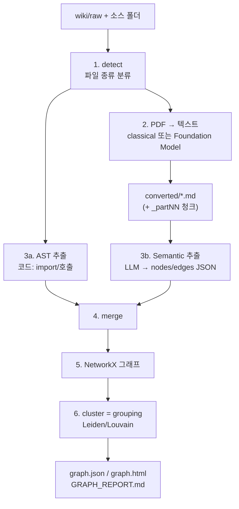
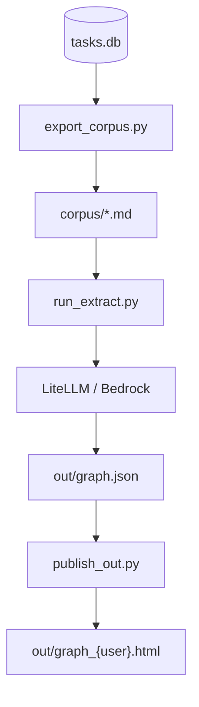

# agent-wiki 그래프 파이프라인

`agent-wiki/graph`에는 지식 그래프를 만드는 파이프라인이 **두 갈래** 있다. 관계는 클러스터링이 만들지 않는다. LLM(또는 코드 AST)이 JSON으로 명시한 엣지 위에서 Leiden/Louvain이 **커뮤니티(그룹)만** 나눈다.

| | **Wiki Sync** (`sync_wiki.py`) | **채팅 KG** (`run_pipeline.py`) |
|---|---|---|
| 트리거 | 앱 Settings → Wiki → Sync | 채팅 후 / 로그인 / 수동 rebuild |
| 입력 | `wiki/raw` + 소스 폴더 (PDF, md, 코드) | `tasks.db` 대화 turn |
| 텍스트화 | PDF multimodal 또는 pdfplumber | turn → `.md` (LLM 없음) |
| 그래프 추출 | AST(코드) + LLM 시맨틱(문서) | LLM 시맨틱만 |
| grouping | Leiden/Louvain 커뮤니티 | 동일 |
| 산출 | `wiki/graphify-out/graph.html` | `out/graph_{user}.html` |

PDF → multimodal 텍스트 → 그래프 추출 → grouping은 **Wiki Sync** 경로다.

관련 문서: `graph/README.md`(실행 방법), `graphify.md`(Graphify vs Graphiti).

---

## Wiki Sync 전체 흐름

앱이 `application/wiki_jobs.py`로 `graph/sync_wiki.py --user …`를 백그라운드 실행한다. 작업 디렉터리는 `.session_storage/{user}/wiki`다.



`run_sync()` 실제 순서 (`graph/sync_wiki.py`):

1. AST extract (코드)
2. Semantic extract (문서/PDF, Foundation Model Parser 설정 시 multimodal)
3. AST + semantic merge
4. `build_from_json` → `cluster` → HTML/JSON/리포트

증분이면 기존 `graph.json`과 합친 뒤 cluster한다. `--full`이거나 이전 산출물이 없으면 전체 detect/extract다.

```bash
cd agent-wiki
python graph/sync_wiki.py --user ksdyb
python graph/sync_wiki.py --user ksdyb --full
```

---

### 1. Detect — 무엇을 그래프로 넣을지

`graphify.detect()`가 소스 폴더를 훑어 파일을 나눈다.

- **code**: `.py`, `.ts`, `.go` …
- **document / paper**: `.md`, `.txt`, **`.pdf`**
- **image**: 위키 싱크에서는 스킵 (`vision not in wiki sync`)

소스 우선순위 (`_resolve_inputs`):

1. CLI `--input`
2. 사용자 `wiki_sources.json` (`AGENT_WIKI_SOURCES`)
3. `{wiki}/raw` (Configure → 문서 추가 inbox)
4. 없으면 `wiki/raw` 또는 wiki 루트

증분이면 `manifest.json`의 mtime과 비교해 **바뀐 파일만** 다시 뽑는다. Office 변환 산출물(`.docx` 등 → markdown)은 소스 옆 `graphify-out/converted`가 아니라 사용자 wiki의 `graphify-out/converted`로 옮긴다.

---

### 2. PDF → 텍스트 (multimodal 단계)

`_run_semantic()`이 문서를 `graphify-out/converted/`에 마크다운으로 올린다. PDF만 파서가 갈린다.

| 모드 | 조건 | 동작 |
|---|---|---|
| **classical** (기본) | Foundation Model Parser off | pdfplumber → 실패 시 pypdf. 페이지별 `## Page N` |
| **Foundation Model** | 사용자 설정 on | PDF → PNG → Bedrock multimodal → Markdown |

Foundation Model 경로 (`graph/pdf2text.py`):

1. **PyMuPDF**로 페이지를 `page_001.png` … 로 렌더 (기존 PNG는 재사용)
2. 각 이미지를 Bedrock vision (`application/mcp_server_text_extraction.py`)에 넣고 Markdown으로 변환
3. 그림·도표도 “무엇이 보이는지”를 풀어 씀 (헤더/푸터는 제외)
4. 페이지마다 `extracted.md`에 append → 중단 후 재개 가능
5. 긴 문서는 **1만 자 단위**로 `{stem}_part01.md`, `_part02.md`로 쪼갬

프롬프트 요지: 페이지를 Markdown으로 구조화하고, 시각 요소는 본문과의 관계까지 서술한다. header/footer(페이지 번호 등)는 출력에서 뺀다.

이미지는 이 단계에서 **텍스트로 바뀐 뒤**에야 그래프 추출에 들어간다. 그래프 LLM이 PDF 바이너리를 직접 보지는 않는다.

중간 산출물 `converted/.pdf_pages/{stem}_{hash}/extracted.md`는 시맨틱 추출 입력에서 제외한다. 최종 텍스트는 `*_partNN.md`에 있다.

시작 실패 시 classical로 fallback한다. 이미 부분 `extracted.md`가 있는 중단은 fallback하지 않고 다음 Sync에서 이어서 한다.

---

### 3. 그래프 추출 — 노드/엣지 JSON

두 경로가 합쳐진다.

#### 3a. AST (코드, LLM 없음)

`graphify.extract()`가 import / 상속 / 호출 등을 결정론적으로 뽑는다. 결과: `.graphify_ast.json`.

코드 쪽 relation 예: `contains`, `imports`, `imports_from`, `inherits`, `method`, `calls`, `uses`.

코드만 바뀐 증분 업데이트면 시맨틱 추출을 건너뛴다.

#### 3b. Semantic (문서, LLM)

`lib/semantic.py`가 스테이징된 `.md`를 **8개 파일씩 청크**로 LiteLLM(또는 Bedrock Converse)에 보낸다. LLM이 아래 JSON만 반환한다.

- **nodes**: 개념·엔티티 (`id`, `label`, `source_file` …)
- **edges**: 관계 + confidence
- **hyperedges**: 3개 이상 노드가 같이 묶이는 경우 (청크당 최대 3개)

허용 relation:

| relation | 의미 |
|---|---|
| `references` / `calls` / `implements` / `cites` | 명시적 참조·호출·구현·인용 |
| `conceptually_related_to` / `shares_data_with` | 개념·데이터 관련 |
| `semantically_similar_to` | 구조 링크 없이 같은 문제 (보통 INFERRED) |
| `rationale_for` | 설계 이유 → 대상 개념 |

confidence:

| 태그 | 의미 | score |
|---|---|---|
| EXTRACTED | 원문에 명시 | 1.0 |
| INFERRED | 추론 | 보통 0.6–0.9 |
| AMBIGUOUS | 불확실 (HTML에서 점선) | 0.1–0.3 |

`--deep`이면 INFERRED를 더 공격적으로 뽑고, 애매한 것은 AMBIGUOUS로 남긴다.

파일 SHA256 캐시(`graphify.cache`)가 있어서 같은 문서는 재호출하지 않는다. 결과: `.graphify_semantic.json`.

---

### 4. Merge

AST 결과와 시맨틱 결과를 `_merge_extracts()`로 합친다. 노드 id는 중복 제거하고, 엣지는 이어 붙인다. 스테이징 `.md` 경로는 원래 PDF/문서 경로로 되돌린다 (`_rewrite_extract_sources`). 합친 결과는 `.graphify_extract.json`.

---

### 5–6. 그래프 빌드 + grouping

```text
build_from_json(extraction)  →  NetworkX 그래프
cluster(G)                   →  Leiden (graspologic) 또는 Louvain
score_all / god_nodes / surprising_connections
→ graph.json, graph.html, GRAPH_REPORT.md
```

- `cluster(G)`는 **새 관계를 만들지 않는다.** 이미 있는 엣지 위에서 “주제 덩어리”만 나눈다.
- 커뮤니티 라벨은 기본 `Community {id}`. HTML 패턴(pattern1/2/3)은 노드 라벨 빈도로 그룹 이름을 추론한다.
- 노드 5000개를 넘으면 HTML viz를 건너뛴다.
- God Nodes = 연결 차수가 높은 허브. Surprising Connections = 커뮤니티/파일 경계를 가로지르는 엣지.

---

## 채팅 KG 파이프라인

PDF는 없고, 대화 로그를 그래프로 만든다. Cursor `/graphify` 스킬 없이 `graph/` 폴더만으로 동작한다.



| 단계 | 스크립트 | LLM? |
|---|---|---|
| 1. DB → corpus | `export_corpus.py` | 없음 |
| 2. corpus → graph.json | `run_extract.py` (`lib/semantic.py`) | LiteLLM 또는 Bedrock |
| 3. 사용자별 HTML | `publish_out.py` | 없음 (클러스터 + rich UI) |

한 번에:

```bash
cd agent-wiki/graph
python run_pipeline.py --user ksdyb
python run_pipeline.py --user ksdyb --full
```

`--user`이면 기본이 **증분**: 바뀐 turn만 `out/.extract_queue.json`에 넣고 추출한다. `--full`이면 코퍼스 전체를 다시 뽑는다. 산출물은 `.session_storage/{user}/graph/` 아래 corpus / out 이다.

turn = `user` 메시지 + 바로 다음 `assistant` 답변. 마크다운 frontmatter에 `task_id`, `user_id`, skills/MCP/tools가 붙는다. prompt/reply는 기본 2000/3000자로 clip한다.

앱 UI: 사이드바 브랜드 클릭 → `GET /api/graph` → `graph/out/graph_{slug}.html`. 백그라운드 잡은 `application/graph_jobs.py`.

---

## LLM 설정

시맨틱 추출은 Cursor `/graphify` 스킬이 아니라 이 폴더의 `lib/llm.py`가 직접 호출한다.

1. **우선**: `application/config.json`의 `llm_gateway_url` / `llm_gateway_key`
2. **fallback**: `LLM_GATEWAY_URL` / `LLM_GATEWAY_KEY`
3. **gateway 없음**: AWS Bedrock Converse (`GRAPHIFY_BEDROCK_REGION` / `GRAPHIFY_BEDROCK_MODEL`)

모델 기본값: `graph/.env`의 `GRAPHIFY_LLM_MODEL` (`claude-haiku-4-5`). Foundation Model Parser(PDF vision)는 별도 Bedrock 모델(`Claude 5.0 Sonnet` 계열, `mcp_server_text_extraction.py`).

---

## 산출물과 주요 파일

### Wiki Sync

```text
.session_storage/{user}/wiki/
├── raw/                         # 업로드 inbox
└── graphify-out/
    ├── converted/               # PDF/문서 → markdown 스테이징
    │   └── .pdf_pages/          # multimodal 중간 PNG + extracted.md
    ├── graph.json
    ├── graph.html
    ├── GRAPH_REPORT.md
    ├── manifest.json            # 증분 detect용
    ├── .graphify_detect.json
    ├── .graphify_ast.json
    ├── .graphify_semantic.json
    └── .graphify_extract.json
```

### 채팅 KG

```text
.session_storage/{user}/graph/
├── corpus/                      # turn-*.md
└── out/
    ├── graph.json
    ├── graph_{user}.html
    ├── cache/                   # SHA256 시맨틱 캐시
    └── .extract_queue.json      # 증분 큐
```

### `graph/` 코드

| 파일 | 역할 |
|---|---|
| `sync_wiki.py` | Wiki: detect → AST → 시맨틱 → cluster |
| `pdf2text.py` | PDF→텍스트 (pdfplumber 또는 Foundation Model) |
| `run_pipeline.py` | 채팅 KG 3단계 일괄 |
| `export_corpus.py` | `tasks.db` → corpus |
| `run_extract.py` | corpus → LLM 추출 → `graph.json` |
| `publish_out.py` | `graph.json` → 사용자별 HTML |
| `lib/semantic.py` | 추출 프롬프트 + 청크/캐시 |
| `lib/build_graph.py` | graphifyy `build_from_json` / `cluster` / export |
| `lib/llm.py` | LiteLLM `/v1` 또는 Bedrock Converse |
| `lib/patterns.py` | HTML pattern1 (Force Atlas) / 2 / 3 |

클러스터·JSON/HTML export 엔진은 PyPI **graphifyy**. 시맨틱 추출 프롬프트는 이 레포 `lib/semantic.py`가 담당한다.

---

## 기억과의 대응

| 기억 | 실제 코드 |
|---|---|
| PDF에서 multimodal로 text 추출 | `pdf2text.py` Foundation Model: PDF→PNG→Bedrock vision |
| 이후 graph 추출 | `lib/semantic.py` LLM → nodes/edges JSON (+ 코드는 AST) |
| grouping | `graphify.cluster()` Leiden/Louvain 커뮤니티 |

multimodal은 **그래프 추출 LLM이 아니라 PDF→텍스트 단계**다. 그래프 LLM은 이미 만든 마크다운만 읽는다.
